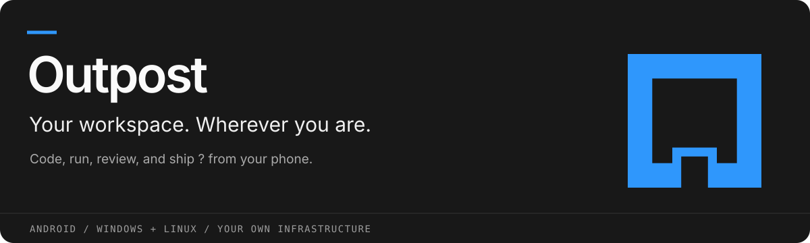
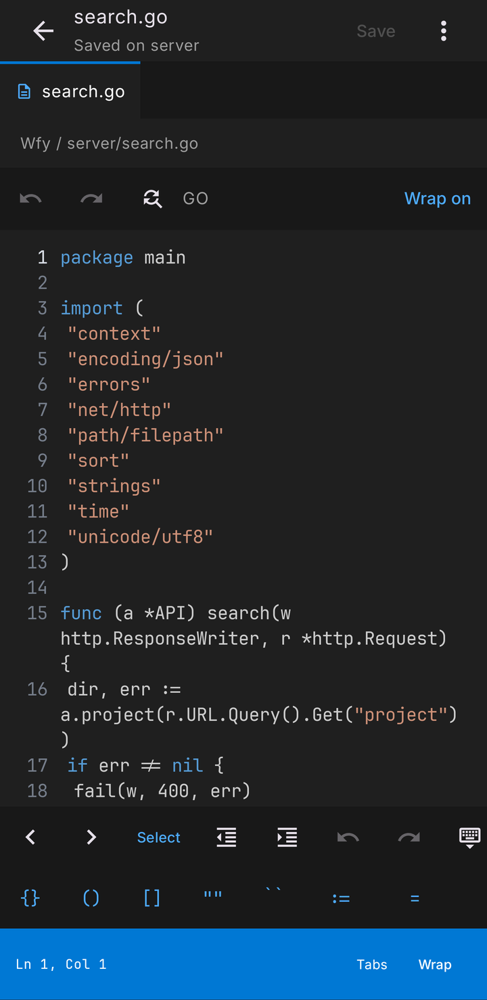
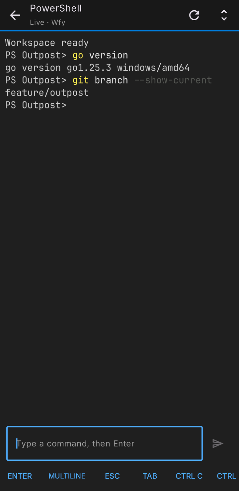
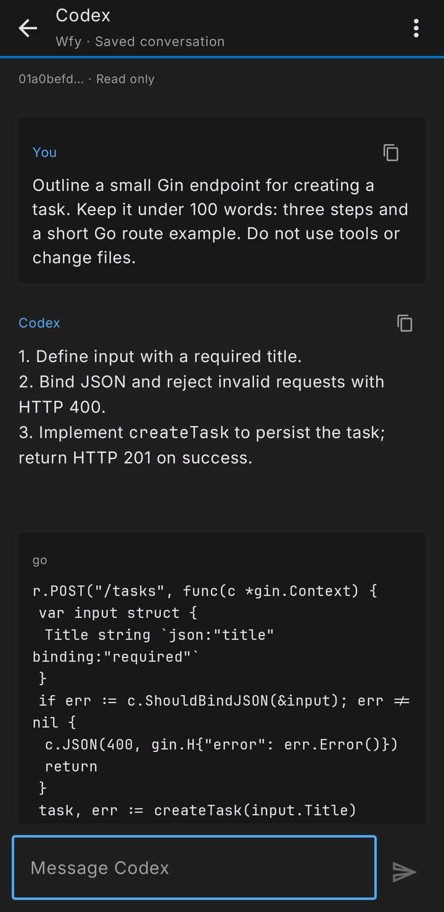
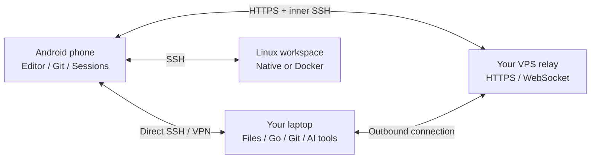

<p align="center">
  
</p>

<p align="center">
  
  
  
  
</p>

<p align="center"><b>Work from home. Work on the go. Keep your actual development environment.</b></p>
<p align="center"><a href="https://github.com/AmarnathCJD/Outpost/releases">Releases</a> &middot; <a href="#get-started">Get started</a> &middot; <a href="#built-for-the-work-between-commits">Features</a> &middot; <a href="#how-it-connects">How it connects</a> &middot; <a href="docs/GUIDE.md">User guide</a> &middot; <a href="docs/RELEASING.md">Build a release</a></p>

Outpost puts your development workspace on your Android phone. Open the repositories on your laptop, edit a Go service, run a migration, talk to your coding assistant, inspect the diff, and open a pull request without moving your project into a separate phone environment.

**Your phone is the interface. Your laptop or Linux server does the work.** Files are saved directly to that host, and terminal sessions keep running when the phone disconnects.

## A look inside

Real screens from an Android phone connected to a Windows laptop through the relay.

| Edit your code | Run your commands | Continue your AI conversation |
|:---:|:---:|:---:|
| [](assets/screenshots/editor.png) | [](assets/screenshots/terminal.png) | [](assets/screenshots/chat.png) |

## From "I need my laptop" to "let me check that"

A backend change does not always wait until you are at your desk. With Outpost, the workflow stays familiar:

```text
Pick your laptop -> Open a repository -> Create a feature workspace
                 -> Edit -> Run -> Review changes -> Commit -> Open a PR
```

Open the same files again on your laptop and continue working. The last workspace and open file reopen after connecting. Saved files pick up laptop changes automatically; unsaved edits stay protected. No duplicate workspace to reconcile. No rooted phone. Native Windows hosting needs neither Docker nor WSL.

## Built for the work between commits

| | What you can do |
|---|---|
| **A phone-friendly editor** | Line numbers with wrapped code, stable keyboard scrolling, syntax highlighting, smart indentation, bracket pairs, cursor controls, snippets, find/replace, undo/redo, and Save beside the keyboard. Inter for the interface; JetBrains Mono for code. |
| **Your files, within reach** | Browse and search repositories, quick-open files, create/move/rename, recover deleted files, and keep encrypted drafts. Revision checks catch conflicting saves. |
| **Git with context** | Read additions and deletions, stage selected files, inspect history, switch branches, fetch, pull, commit, and manage stashes. |
| **Pull requests on your phone** | Search PRs, read descriptions and comments, inspect changed files, and check their status. Create feature PRs through GitHub. |
| **Terminals that stay with the work** | Bash/tmux on Linux and native PowerShell/ConPTY on Windows. Disconnect your phone and resume the running session later. |
| **Your coding assistants** | Native chat with Codex and Claude Code, saved conversation IDs, resumable context, tool activity and the host's existing CLI configuration. |
| **Go backend development** | Run builds, tests, `go mod tidy`, service commands, migrations, and seeders. The Linux Docker setup can include SQL Server. |
| **Separate migration work** | Dedicated migration worktrees, configurable branch rules, protected main branches, and an explicit migration-push confirmation. |

## Pair once. Find your laptop next time.

Outpost's **Hosts** screen is your starting point when you use a VPS relay:

1. Start hosting on the laptop. It registers its identity and connection profile with your relay.
2. Open **Pair a phone** on the desktop and scan its QR code in Android. You can also paste an invitation, or enter the relay address and pairing code.
3. Your laptop appears by name. Tap **Connect**. SSH details and API credentials are filled automatically.
4. Next time, see your saved laptops, their online status, and last seen time. Optionally connect to the last laptop when the app opens.

Pair several laptops to the same phone. Each gets a separate route and workspace identity. Discovery is private: a pairing code finds its matching laptop; the relay does not publish a directory of hosts.

## Same laptop. Same conversation.

Send a task to Codex or Claude from a native phone composer, read the response, and review tool activity alongside your work. Outpost uses the CLI and configuration already installed on your host, including custom Codex providers.

Conversation IDs and chat history are saved on the host. Reopen a chat after a phone disconnect or host restart and continue with the same context. Already started on the laptop? Paste its conversation ID into **New chat** to resume it on your phone.

[AI setup and conversation guide](docs/ASSISTANTS.md)

## How it connects



**At home:** connect directly over your local network or VPN.  
**On changing networks:** both laptop and phone connect to the VPS over HTTPS. The laptop needs no static IP or inbound router forwarding.  
**Using a Linux workspace:** connect to its SSH server and run everything there.

The relay forwards the encrypted SSH connection. Pairing profiles are encrypted on the laptop, and the phone verifies the laptop's SSH identity after decrypting them. The relay does not receive your plaintext workspace credentials.

## Get started

### Windows laptop + Android

1. Download and extract **`outpost-windows.zip`**, keeping all its files together. Open **`Outpost.exe`**.
2. Choose the parent folder containing your repositories under **Workspace**, then select **Start hosting**.
3. Install **`outpost.apk`** on your Android phone.
4. For direct LAN/VPN access, use the desktop's **Phone access** details. For discovery and access away from home, configure a VPS relay and use **Pair a phone**.

The desktop includes workspace configuration, developer-tool setup, Git/environment settings, and tray hosting. Closing its window keeps hosting in the tray; **Exit and stop hosting** shuts it down.

[Windows setup](docs/WINDOWS.md) | [Pairing and discovery](docs/PAIRING.md)

### Add a VPS relay

Extract **`outpost-relay-linux-amd64.tar.gz`** on your Ubuntu VPS and run:

```bash
sudo bash install.sh ./outpost-relay
```

Configure the HTTPS proxy route for a domain you control, then enter the relay details in the Windows desktop. The installer preserves the relay's token, SSH identity, and host registry across updates.

[Relay deployment and HTTPS configuration](relay/README.md)

### Use a Linux development server

Extract **`outpost-server.tar.gz`**, then run:

```bash
sudo bash deploy/bootstrap.sh
```

This installs the Docker deployment, developer tools, and SQL Server. For an existing Linux environment, use **`outpost-server-linux-amd64.tar.gz`** instead.

[Full setup guide](docs/GUIDE.md) | [Native Linux setup](docs/LINUX-NATIVE.md)

## A few things to know

- Keep your host powered on and online. Phone disconnections preserve running terminals; stopping the host or shutting it down ends them.
- Phone saves edit the host's actual files. Outpost does not replicate files between independent laptops or servers; use Git for that workflow.
- GitHub and assistant logins use your own accounts. CLI subscriptions and API billing follow each provider's rules.
- Branch checks help protect the workflow. Use GitHub branch protection for repository-level enforcement.
- A release-signed APK cannot update a debug-signed installation in place. Keep your signing key for future release updates.

## Built with

**Android:** Kotlin, Jetpack Compose, OkHttp, JSch, and ZXing.  
**Workspace backend:** Go, native filesystem/Git operations, tmux on Linux, and ConPTY on Windows.  
**Desktop host:** .NET / WinForms, with its runtime included.  
**Relay:** Go, SSH forwarding, WebSocket transport, and systemd deployment.

```text
app/       Android app              desktop/   Windows host UI
server/    Workspace backend        relay/     VPS relay service
deploy/    Linux Docker deployment  scripts/   Build and packaging
docs/      Setup and architecture   assets/    Outpost branding
```

[Build and release instructions](docs/RELEASING.md) | [Architecture](docs/ARCHITECTURE.md) | [Validation record](docs/VALIDATION.md) | [Third-party notices](docs/THIRD-PARTY-NOTICES.txt)

---

<p align="center"><b>Your tools. Your machines. A little more freedom to move.</b><br>Built by <a href="https://github.com/AmarnathCJD">AmarnathCJD</a>.</p>
