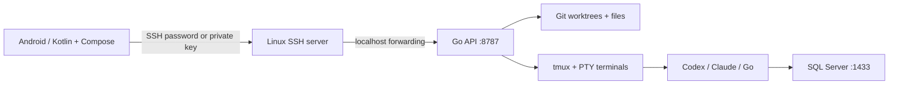

# Outpost

Outpost is a personal Android interface to a Linux or native Windows development workspace. Android never hosts Go, Git, SQL Server, or the AI CLIs.

The backend and SQL Server run in separate Docker containers. Only the backend's port is published, bound to host loopback. The host SSH daemon handles authentication and encrypted transport. There is no SSH daemon inside the development container and no Docker socket mounted into it.

On Windows, the same Go API runs natively on loopback and operates on existing laptop repositories. A self-contained WinForms desktop application selects the root, manages the host and direct phone access, edits workspace settings, and stays in the tray. Its token is protected for the Windows user with DPAPI. Terminals use ConPTY and PowerShell with a bounded replay buffer, surviving phone disconnects while the backend remains running. Windows no-overwrite moves use `MoveFileEx` without the replace flag.

By default, the Windows backend embeds an SSH endpoint on port 2222. Android connects directly to the laptop Wi-Fi or VPN address and forwards to the local API. SSH authenticates the configured Outpost username using the desktop token or an authorized public key; a persistent Ed25519 host key identifies the laptop. Forwarding permits loopback destinations only. Interactive sessions remain managed by the API. A firewall rule allows the selected executable and port. VPN or router configuration is needed for access beyond the LAN.

An optional external-relay mode is also available: desktop OpenSSH opens a loopback reverse forward on the Ubuntu relay. Android's existing SSH tunnel targets that relay port. An optional second forward previews a native development service. A Windows job object prevents orphaned persistent SSH relays after a desktop crash; the backend can be reattached when the desktop reopens. Laptop and Ubuntu workspaces are independent, not automatically replicated.

The workspace container runs as UID 10001, drops Linux capabilities, disables privilege escalation, and uses bounded memory, CPU and process counts. SQL Server Developer is for development/test workloads. Named volumes retain repositories, CLI authentication, tool configuration, and database files across container recreation. `tmux` survives phone/network disconnections; it does not survive container or server restarts.

Android credentials are AES-GCM encrypted with an Android Keystore key. SSH host keys require explicit trust on first contact or change. API requests require a random bearer token and reject browser Origin headers. The local HTTP/WebSocket connection is carried inside SSH; cleartext Android network access is limited to localhost. The terminal WebView loads bundled xterm.js assets through a private HTTPS asset origin; it cannot navigate to websites or access files.

File access uses Go's `os.Root` to prevent escaping the workspace root, including symlink traversal outside that root. The editor uses content-hash revisions to reject stale saves, writes via a temporary file, and moves deleted paths into `.wfy/trash`. It is a UTF-8 text editor with a 2 MiB limit. Remote file/Git lists refresh at a configurable interval; terminals stream via WebSocket. Unsaved editor buffers are not silently replaced by remote changes.

Drafts are encrypted locally and retain the original revision and branch. Drafts, pins and session controls use an identity that includes the SSH host/port/user and backend destination. Request generations discard stale connection results; cancelled HTTP calls close their underlying requests. Terminal processes stay on the server during transport reconnects. Additional service ports bind only to the phone's loopback and close with SSH.

Recovery entries carry their original path and deletion time. Linux rename/restore uses `RENAME_NOREPLACE` so an existing destination cannot be overwritten. Commit history holds a reference across pages. Stash origin metadata distinguishes feature work from migration work and unverified terminal-created stashes; applying a verified feature stash retains its saved copy.

Feature and migration branches have separate worktrees. The API blocks protected-branch commits/pushes, migration-to-feature workspace creation, migration branch switching, and feature PR creation from migration workspaces. Migration push requires an explicit approval assertion. Local pre-push hooks add protection for CLI operations. Arbitrary terminal/AI commands can bypass local hooks; use GitHub branch rules and restricted credentials to enforce team policy. Outpost cannot verify a manager's approval independently.

AI chats run the installed CLIs as background jobs: Codex JSONL exec/resume and Claude stream-json print/resume. The host saves the provider conversation ID and a bounded display history atomically under `.wfy/chats`. Reconnection and host restarts retain context through the CLI's own session storage. Phone message request IDs prevent duplicate turns after a lost response; one assistant runs per workspace/conversation, with four concurrent jobs across the host. Stop cancels the CLI process tree. Native drafts are encrypted on Android. Interactive terminals remain available for login and provider permission prompts. The existing hosting user's configuration and environment are preserved, including custom Codex providers; invocation-only nested-agent flags are removed.

Codex chat uses workspace-write sandboxing (or read-only mode) with noninteractive approvals. Claude uses acceptEdits or plan mode. Operations requiring interactive approval can be continued in the terminal. No subscription tokens are scraped or translated into API credits.

The server is deliberately a single-user trust domain. Authenticated terminal/AI users can execute code and read that workspace's files and credentials. This is not a hostile multi-tenant execution sandbox.

Main source areas: `app/.../Connection.kt` (SSH, vault, HTTP), `WorkspaceModel.kt` (state/actions), Compose screen files, `server/api.go` (files/settings), `git.go` (workflow policies), and `terminal_linux.go`/`sessions.go` (PTY/tmux).

The standalone `relay/` Go module accepts an outbound authenticated SSH connection from Windows and assigns each registered laptop a private loopback phone listener; the legacy fixed listener remains for manual connections. Phone SSH remains end-to-end with the laptop host key; the relay has no workspace API. Optional binary WebSocket streams carry both SSH connections over an existing HTTPS proxy. The Android socket adapter preserves stream semantics with bounded buffers and standard TLS validation. Windows reconnects with bounded backoff and keeps native terminal processes independent of transport loss.

The editor uses bundled Inter and JetBrains Mono fonts, with their OFL licenses in Android assets. Keyboard transforms apply only to completed single-character edits, leaving composition and pasted text intact. Selection offsets remain UTF-16 indices while cursor buttons move across Unicode code points.

Host discovery uses a persistent encrypted-profile registry. A generated pairing code derives separate lookup and AES-GCM profile keys. Each registration carries proof signed by the laptop SSH key over the control session ID; host IDs are hashes of that public key. Android decrypts the profile locally, pins the key, stores the pairing in its encrypted vault, and includes the laptop ID in workspace/session state. The relay exposes no public enumeration endpoint.
